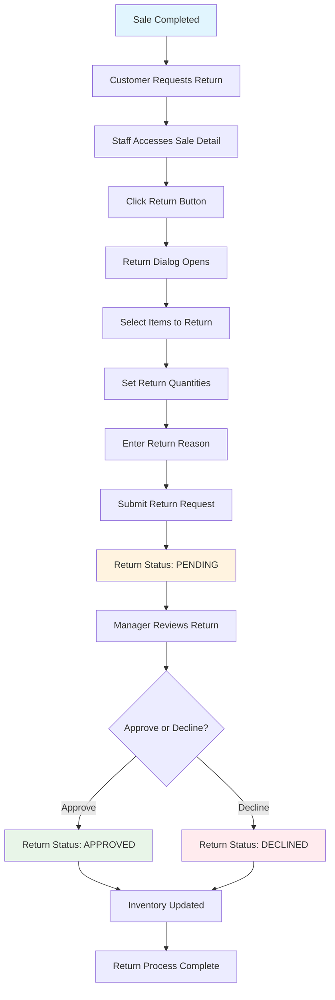
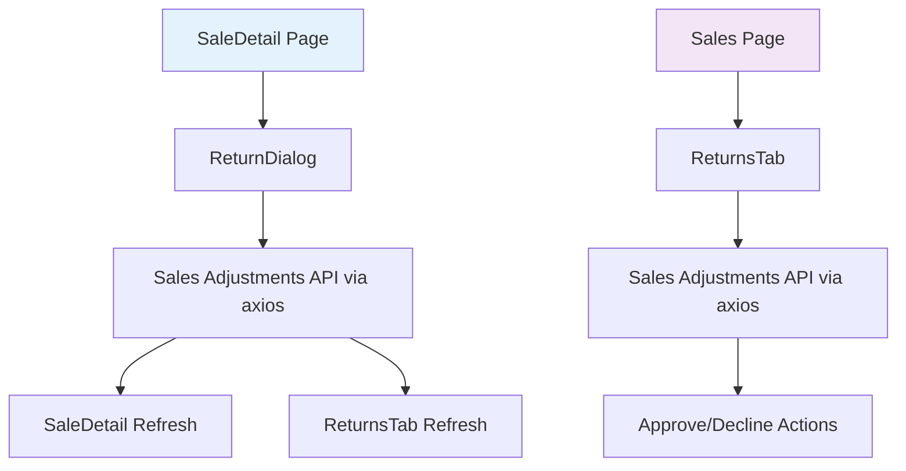

# Sales Returns System Design & Implementation

## Overview

The Sales Returns system provides a streamlined way to process returns for sales transactions. It integrates seamlessly with the existing Sales Adjustments Module and follows the same approval workflow patterns used throughout the application.

## System Architecture

### Component Structure

```
src/
├── components/
│   ├── sales/
│   │   ├── ReturnDialog.tsx           # Return request creation dialog
│   │   └── ReturnsTab.tsx             # Returns list and management
├── pages/
│   ├── SaleDetail.tsx                 # Enhanced with Return button
│   └── Sales.tsx                      # Added Returns tab
└── services/
    └── sales.ts                       # Extended with return APIs
```

### Key Components

#### 1. ReturnDialog Component
**Location**: `src/components/sales/ReturnDialog.tsx`

**Purpose**: Modal dialog for creating return requests from individual sales

**Features**:
- Product selection from the original sale with quantity adjustment
- Reason input using textarea (replacing select dropdown)
- Real-time return value calculation
- Validation for return quantities
- Integration with existing sales adjustments API using axios
- Fixed number input formatting (no leading zeros)
- Uses centralized API configuration from `@/lib/api`

**Props**:
```typescript
interface ReturnDialogProps {
  sale: Sale;
  onReturnCreated?: () => void;
}
```

#### 2. ReturnsTab Component
**Location**: `src/components/sales/ReturnsTab.tsx`

**Purpose**: Tab content for viewing and managing all return requests

**Features**:
- Paginated table of all return requests
- Search and filtering capabilities
- Status-based filtering (Pending, Approved, Declined)
- Approval/decline actions for authorized users with confirmation dialogs
- Integration with sales adjustments API endpoints using axios
- Text-based action buttons (Approve/Decline) with appropriate styling

**Key Functionalities**:
- View all return requests with sale details
- Approve/decline pending returns with confirmation dialogs
- Search by receipt number or customer name
- Date range filtering
- Proper status badges following app patterns
- Action buttons with text and appropriate styling:
  - Approve: `bg-primary hover:bg-primary/90`
  - Decline: `bg-destructive hover:bg-destructive/90`

#### 3. Enhanced SaleDetail Page
**Location**: `src/pages/SaleDetail.tsx`

**Enhancements**:
- Added Return button to action toolbar (line 294)
- Integrated ReturnDialog component
- Maintains existing payment and view functionality
- Added RotateCcw icon import

#### 4. Updated Sales Page
**Location**: `src/pages/Sales.tsx`

**Changes**:
- Added 4th tab: "Returns"
- Updated TabsList from `grid-cols-3` to `grid-cols-4`
- Integrated ReturnsTab component
- Navigation to Returns tab: `/sales?tab=returns`

## Return Workflow

### User Journey Flow



### Component Architecture Flow



## API Integration

### Axios Configuration

The system uses axios with centralized configuration from `@/lib/api`:

```typescript
import { api } from '@/lib/api';

// Base configuration
const API_BASE_URL = 
  import.meta.env.VITE_API_BASE_URL ||
  'http://localhost:3000/api';

export const api = axios.create({
  baseURL: API_BASE_URL,
  withCredentials: true, // To send cookies for refresh token
});
```

### Endpoints Used

The system leverages the existing Sales Adjustments API:

1. **GET `/api/sales-adjustments`**
   - Retrieves all sales adjustments (returns) with pagination
   - Used by ReturnsTab for listing returns
   - Endpoint: `/sales-adjustments` (relative to base URL)
   - Response Format:
     ```json
     {
       "returns": [...],
       "total": 45,
       "totalPages": 5,
       "currentPage": 1
     }
     ```

2. **POST `/api/sales-adjustments`**
   - Creates new return requests
   - Used by ReturnDialog for submitting returns
   - Endpoint: `/sales-adjustments`

3. **PATCH `/api/sales-adjustments/:id/approve`**
   - Approves pending return requests
   - Used by ReturnsTab for approval actions
   - Endpoint: `/sales-adjustments/${id}/approve`

4. **PATCH `/api/sales-adjustments/:id/decline`**
   - Declines return requests
   - Used by ReturnsTab for decline actions
   - Endpoint: `/sales-adjustments/${id}/decline`

### Data Structure

```typescript
interface SalesAdjustment {
  id: number;
  saleId: number;
  reason: string;
  status: 'PENDING' | 'APPROVED' | 'DECLINED';
  createdAt: string;
  requestedBy: {
    id: number;
    name: string;
  };
  approvedBy?: {
    id: number;
    name: string;
  };
  items: Array<{
    id: number;
    productId: number;
    quantity: number;  // Negative for returns
    notes?: string;
    product?: {
      id: number;
      name: string;
      price: number;
    };
  }>;
}
```

## User Permissions

### Required Permissions

1. **View Returns**: `view:sales-adjustments`
   - Access to Returns tab and list view
   - Required for all return-related functionality

2. **Create Returns**: `create:sales-adjustments`
   - Ability to create new return requests
   - Used by ReturnDialog component

3. **Approve Returns**: `approve:sales-adjustments`
   - Ability to approve/decline return requests
   - Controls visibility of approval buttons in ReturnsTab

### Permission Integration

- Returns tab is accessible based on same permission
- Action buttons (Approve/Decline) appear only if user has `approve:sales-adjustments`

## Implementation Details

### Fixed Issues

1. **Axios Integration**
   - Replaced fetch API calls with axios for consistency
   - Uses centralized API configuration
   - Improved error handling with axios error structure

2. **API Response Handling**
   - Fixed ReturnsTab to handle paginated API response format
   - Updated to parse `{ returns: [], total, totalPages, currentPage }` structure
   - Proper pagination data handling for large datasets

3. **Number Input Formatting**
   - Fixed weird behavior where 0 becomes "01"
   - Implemented proper placeholder handling for empty values
   - Used `value={item.returnQuantity === 0 ? "" : item.returnQuantity.toString()}`

4. **Reason Input Enhancement**
   - Replaced Select dropdown with Textarea component
   - Allows free-form text input for return reasons
   - Improves flexibility for return documentation

5. **UI Component Fixes**
   - Fixed AlertDialogAction variant property error
   - Applied proper className styling for destructive actions
   - Fixed Navigation.tsx import syntax error
   - Updated status badges to match PurchaseOrdersTab patterns
   - Changed action buttons from icons to text with appropriate styling
   - Implemented proper confirmation dialogs for approve/decline actions

6. **Navigation Cleanup**
   - Removed redundant Returns navigation item from Navigation.tsx
   - Returns are accessible via Sales page tab: `/sales?tab=returns`
   - Removed unused RotateCcw icon import from Navigation.tsx

### Key Features Implemented

1. **ReturnDialog Features**:
   - Product list from original sale
   - Quantity adjustment controls (0 to original quantity)
   - Real-time return value calculation
   - Textarea for return reasons
   - Form validation
   - Loading states and error handling
   - Axios-based API integration

2. **ReturnsTab Features**:
   - Paginated return list
   - Search functionality
   - Status filtering
   - Approval/decline actions
   - Return value formatting
   - User-friendly status badges
   - Axios-based API integration

3. **Integration Features**:
   - Direct navigation to returns via Sales tab
   - Permission-based access control
   - Consistent UI/UX with existing patterns
   - Real-time data updates

## UI/UX Patterns

### Consistent Design Elements

1. **Dialog Patterns**
   - Follows existing modal dialog conventions
   - Consistent form validation and error handling
   - Loading states with appropriate feedback

2. **Table Patterns**
   - Pagination matching other tabs
   - Search and filter capabilities
   - Status badges with consistent color coding

3. **Action Patterns**
   - Confirmation dialogs for destructive actions
   - Toast notifications for user feedback
   - Consistent button styling and states

### User Experience Flow

1. **Creating Returns**
   - Single dialog from sale detail
   - Intuitive item selection
   - Real-time value calculation
   - Clear validation feedback

2. **Managing Returns**
   - Centralized returns list via Sales page tab
   - Quick approval/decline actions
   - Comprehensive filtering and search
   - Clear status indicators

## Testing Considerations

### Unit Testing
- Component rendering with various prop combinations
- Form validation logic
- API integration error handling
- Permission-based component behavior

### Integration Testing
- End-to-end return creation workflow
- Approval/decline process
- Navigation and tab switching
- Data persistence and retrieval
- Axios API calls and error handling

## Future Enhancements

### Potential Improvements

1. **Advanced Filtering**
   - Filter by return reason
   - Filter by return value ranges
   - Filter by time periods

2. **Bulk Operations**
   - Bulk approve/decline multiple returns
   - Batch return processing

3. **Return Analytics**
   - Return rate tracking
   - Most returned products
   - Return reason analysis

4. **Mobile Optimization**
   - Touch-friendly return creation
   - Mobile-optimized returns list
   - Responsive design improvements

## Deployment Notes

### Environment Requirements

1. **Backend API**
   - Sales Adjustments endpoints must be functional
   - Proper CORS configuration for frontend requests
   - Authentication and authorization setup

2. **Database**
   - Sales adjustments table structure
   - Proper indexes for performance
   - Data integrity constraints

3. **Permissions**
   - User roles updated with sales adjustments permissions
   - Permission synchronization between frontend and backend

### Configuration

1. **Frontend**
   - API endpoint configuration via VITE_API_BASE_URL or default
   - Permission mapping
   - Feature flags (if needed)

2. **Backend**
   - Return reason configuration
   - Approval workflow settings
   - Integration with other modules

This implementation provides a comprehensive and user-friendly returns management solution that integrates seamlessly with the existing system architecture while following established patterns and conventions. The use of axios ensures consistency with the rest of the application, and the removal of redundant navigation items streamlines the user interface.